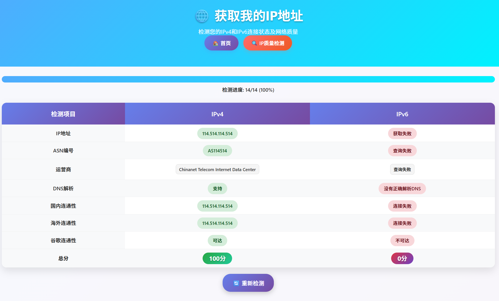
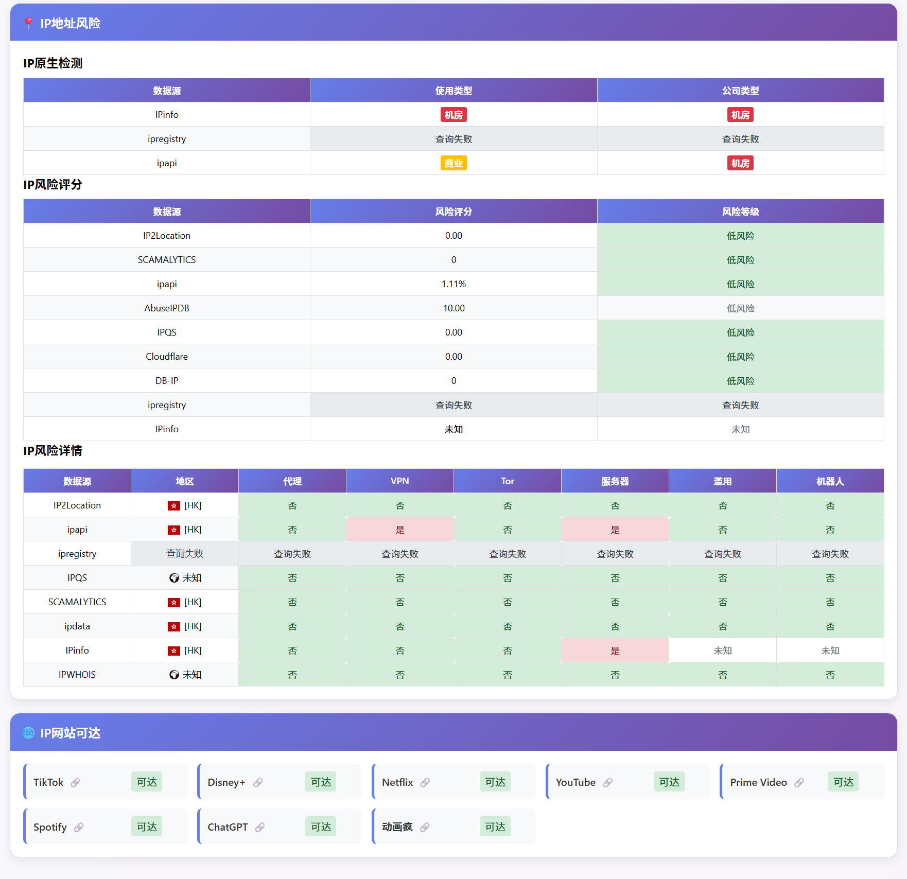
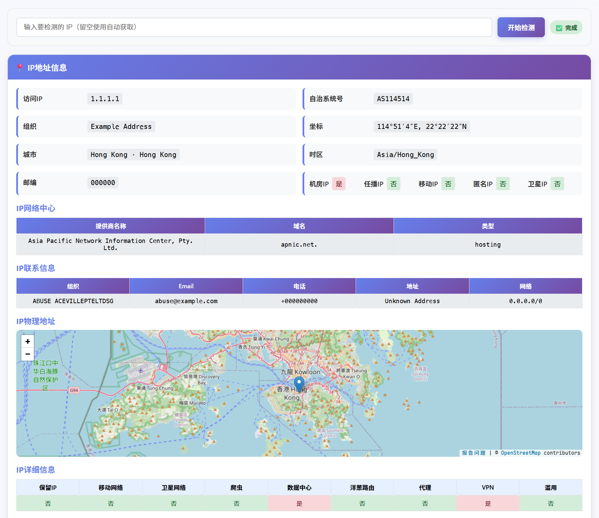

# IPConfig Worker - 检测IP地址和质量

## 项目说明

本项目用于查询并展示您的 IPv4/IPv6 地址、国内/海外连通性、以及 ASN 信息。前端页面通过后端提供的 JSONP 与代理接口进行检测与解析。

声明：本站仅提供 IP 地址查询的功能，不提供其它任何服务，也不与别的网站有任何合作。

---

Demo: https://ipaddr.524228.xyz

## 页面预览

### IP地址查询
- IPv4/IPv6 地址检测：
    - 国内：`https://ipv4.ddnspod.com/`、`https://ipv6.ddnspod.com/`
    - 海外：`https://api.ipify.org/`、`https://api6.ipify.org/`。
- Google 可达性：
    - IPv4：请求 `https://www.google.com/`，成功判定 “可达”。
    - IPv6：请求 `https://[2001:4860:4860::8888]/` 判定可达与否。
- ASN/运营商：通过后端 `POST /api/asn` 查询 ASN 编号、ISP/组织信息。

### IP地址质量
- 基础信息卡片：显示 IP、ASN、组织、坐标（含地图）、城市、时区、邮编、IP 类型（机房/任播/移动/匿名/卫星）、公司与 Abuse 联系信息。
- IP 详细信息：渲染 `api.ipapi.is` 原始字段（is_*、数据中心、公司、ASN、位置等）。

### IP地址风险
- 多源风险聚合：汇总 `ipinfo.io`、`ipapi.is`、`IP2Location`、`Scamalytics`、`ipregistry`、`IPQualityScore(IPQS)`、`IPData`、`IPWhois`、`DB-IP`、`AbuseIPDB`、`Cloudflare` 的使用类型、公司类型、国家代码与风险因子，并展示评分与风险等级。
- 媒体可达性：并行检查 `TikTok`、`Disney+`、`Netflix`、`YouTube`、`Prime Video`、`Spotify`、`ChatGPT`、`动画疯` 是否可达

## 部署方法
### 一键部署

|                   Cloudflare Worker 全球站                   |                                                                                                                                 EdgeOsne Functions 国际站                                                                                                                                 |                   EdgeOne Functions 中国站                   |
| :----------------------------------------------------------: |:--------------------------------------------------------------------------------------------------------------------------------------------------------------------------------------------------------------------------------------------------------------------------------------:| :----------------------------------------------------------: |
|  |  |  |

部署完成后，请登录[EdgeOne Pages海外后台](https://console.tencentcloud.com/edgeone/pages) / [EdgeOne Pages国内后台](https://console.cloud.tencent.com/edgeone/pages) / [Cloudflare Worker后台](https://dash.cloudflare.com/)，修改环境变量，请参考[手动部署](#手动部署)部分

### 手动部署

**Cloudflare Workers**

- 命令：`npm run deploy` 或 `npm run deploy-cf`
- 配置：`wrangler.jsonc` 指定 `main: src/index.ts`、`site.bucket: ./public`、`compatibility_flags: ["nodejs_compat"]`。

**EdgeOne Pages（函数）**
- 命令：`npm run deploy-eo`
- 配置：`edgeone.json` 配置根路径重写 `/index.html`。

**Node.js 自托管**
- 构建：`npm run build-js`
- 运行：`npm run deploy-js`（执行 `node dist/bundle.js`）

**环境变量与密钥**
- `ABUSEIPDB_KEY`：用于 AbuseIPDB 查询。
- `IPQS_KEY`：用于 IPQualityScore 查询。
- `IP2LOCATION_KEY`（可选）：用于 IP2Location 官方接口。
- Cloudflare 配置方式：
  - 推荐使用密钥：`wrangler secret put ABUSEIPDB_KEY`、`wrangler secret put IPQS_KEY`、`wrangler secret put IP2LOCATION_KEY`；
  - 或在 `wrangler.jsonc` 的 `vars` 中设置（示例参考 `wrangler.encrypt.jsonc`）。

## 调试代码

**Cloudflare Workers 开发**

- `npm install`
- `npm run dev`
- 访问：`http://127.0.0.1:8787/`
- 页面：`/index.html` 与 `/check.html`

**仅前端静态预览（可选）**

- 在项目根目录运行：`python -m http.server 8000`
- 访问：`http://localhost:8000/public/index.html`、`http://localhost:8000/public/check.html`

访问开发服务器：`http://127.0.0.1:8787/`

## API 文档

> ### **`POST /api/asn`**
>
> - 请求：`Content-Type: application/x-www-form-urlencoded`
> - 参数：`ip=<IPv4|IPv6>`
> - 响应：`{ "ASN": "ASXXXX" | "未知", "as_info": "<ISP或组织>" | "未知", "as_domain": "<组织>" | "未知" }`
> - 数据源：优先 `ip-api.com`，失败回退 `ipwho.is`。
> - 示例：
>   - `curl -s -X POST -H "Content-Type: application/x-www-form-urlencoded" -d "ip=8.8.8.8" http://127.0.0.1:8787/api/asn`
>
> ### **`POST /api/ip-info`**
>
> - 请求：`Content-Type: application/x-www-form-urlencoded`
> - 参数：`ip=<IPv4|IPv6>`
> - 响应：聚合 `ipinfo.io → ip-api.com → ipwho.is`，返回：
>   - `source`、`ip`、`asn`、`isp`、`org`、`country/countryCode/region/city/postal`、`lat/lon`、`timezone`；
>   - `ipinfo.io` 来源附带 `company`、`abuse`、`privacy`（`vpn/proxy/tor/relay/hosting`）。
> - 示例：
>   - `curl -s -X POST -H "Content-Type: application/x-www-form-urlencoded" -d "ip=1.1.1.1" http://127.0.0.1:8787/api/ip-info`
>
> ### **`GET /api/ip-info`**
>
> - 行为：根据请求头推断客户端 IP，优先级：`CF-Connecting-IP → X-Forwarded-For(首个) → True-Client-IP → X-Real-IP`。
> - 数据源：`ipinfo.io widget demo`，字段同上。
>
> ### **`POST /api/ip-quality`**
>
> - 请求：`Content-Type: application/x-www-form-urlencoded`
> - 参数：`ip=<IPv4|IPv6>`
> - 响应：`{ ip, ipinfo, ipapi, ip2location, scamalytics, ipregistry, ipqs, ipdata, ipwhois, dbip, abuseipdb, cloudflare, errors }`
> - 每项可能包含：`countryCode/proxy/vpn/tor/relay/server/datacenter/abuser/robot/usageType/companyType/score/risk`（视数据源而定）。
> - 示例：
>   - `curl -s -X POST -H "Content-Type: application/x-www-form-urlencoded" -d "ip=8.8.4.4" http://127.0.0.1:8787/api/ip-quality`
>
> ### **`GET /api/client-ip`**
>
> - 响应：`{ "ip": "<客户端IP>" }`（供前端在未手动输入时获取 IP）。
>

## 三方服务
> - `ipinfo.io`（基础信息、公司与 Abuse、隐私标记）
> - `ip-api.com`（基础信息、`proxy/hosting`）
> - `ipwho.is`（基础信息与连接信息）
> - `api.ipapi.is`（详细字段与风险评分）
> - `IP2Location`（风险评分与数据中心/代理标记）
> - `Scamalytics`（欺诈分与风险等级）
> - `ipregistry`（用途类型，演示使用 `tryout` Key）
> - `IPQualityScore`（风险评分、代理/VPN/Tor 检测）
> - `IPData`、`IPWhois`、`DB-IP`、`AbuseIPDB`、`Cloudflare`（补充评分与安全标记）
>

## 注意事项
> - 部分外部接口存在速率或区域访问限制，可能会出现无法查询的情况
> - 媒体站点可达性采用 `no-cors` 请求，仅判定是否可达，不涉及登录或区域解锁。
> - 后端查询失败时，API 返回默认结构以保持前端可用（例如 `/api/asn` 返回 “未知”）。
>

## 引用资料

> 1. [xykt/IPQuality: IP质量检测脚本 - IP Quality Check Script](https://github.com/xykt/IPQuality)
> 2. [IP111 - 显示查询自己的IP地址](https://ip111.cn/)
> 3. [IPv6 测试](https://test-ipv6.com/index.html.zh_CN)
